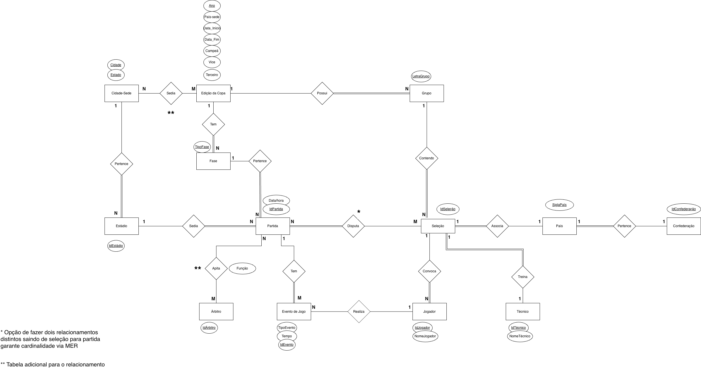
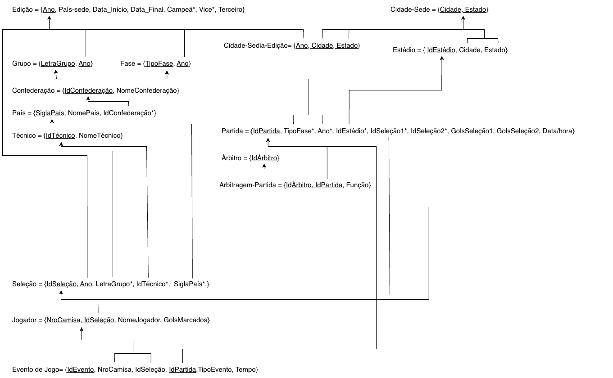
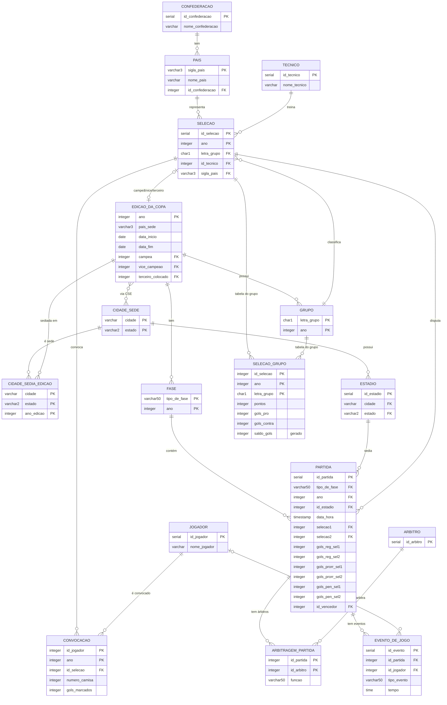

# 🏆 Sistema de Copas do Mundo FIFA

> **SCC0640 Bases de Dados** | USP / ICMC  
> Prof. Jose Fernando Rodrigues Junior

---

## 👥 Grupo

<!-- MEMBROS_START -->
| Nome | Nº USP | Responsabilidade na apresentação |
|------|--------|----------------------------------|
| João Marcelo Moreira Trovão Filho | 13676332 | DER + Modelo Relacional |
| André Luiz Santos Messias | 15493857 | DDL + DML + Triggers |
| Mateus Santos Messias | 12548000 | Implementação do Protótipo |
| Pedro Borges Gudin | 12547997 | Execução + Demonstração |
<!-- MEMBROS_END -->

---

## 📋 Descrição

Sistema de banco de dados para gerenciamento completo de edições da Copa do Mundo FIFA. Armazena e consulta informações sobre seleções, países, confederações, jogadores, técnicos, árbitros, estádios, cidades-sede, partidas, fases, grupos, convocações e eventos de jogo.

A carga de dados cobre as Copas de **1998, 2002, 2006, 2010, 2014, 2018 e 2022**,
período com 32 seleções por edição e máximo de 7 jogos por seleção. A Copa de
2026 foi excluída por ter outro formato.

---

## 📐 Diagramas

### Diagrama Entidade-Relacionamento (DER)



_[Abrir no draw.io viewer →](https://viewer.diagrams.net/?tags=%7B%7D&target=blank&highlight=0000ff&edit=https%3A%2F%2Fapp.diagrams.net%2F&layers=1&nav=1#Uhttps%3A%2F%2Fraw.githubusercontent.com%2FGUUDIN%2Fbd-copa-do-mundo%2Fmain%2Fdiagramas%2FDER.drawio)_

---

### Modelo Relacional (Crow's Foot)



_[Abrir no draw.io viewer →](https://viewer.diagrams.net/?tags=%7B%7D&target=blank&highlight=0000ff&edit=https%3A%2F%2Fapp.diagrams.net%2F&layers=1&nav=1#Uhttps%3A%2F%2Fraw.githubusercontent.com%2FGUUDIN%2Fbd-copa-do-mundo%2Fmain%2Fdiagramas%2FMER.drawio)_

---

## 🗄️ Esquema do Banco

O banco possui **17 tabelas** modeladas em PostgreSQL:



---

## ⚙️ Regras de Negócio (Triggers)

| # | Trigger | Regra |
|---|---------|-------|
| 1 | `trg_limite_convocacao` | Máximo de 26 jogadores convocados por seleção por edição |
| 2 | `trg_estadio_edicao` | O estádio da partida deve pertencer a uma cidade-sede daquela edição |
| 3 | `trg_jogador_partida` | O jogador de um evento deve estar convocado em uma das seleções da partida |
| 4 | `trg_gols_jogador` | Mantém `gols_marcados` em `convocacao` sincronizado automaticamente com os eventos |

---

## 📋 Consultas Suportadas

| # | Consulta |
|---|----------|
| 1 | Todas as edições: ano, país-sede e campeão |
| 2 | Seleções participantes de uma edição |
| 3 | Grupos de uma edição e suas seleções |
| 4 | Tabela de classificação de um grupo (pontos, saldo, gols) |
| 5 | Partidas de uma edição (fase, data, estádio, placar) |
| 6 | Caminho do mata-mata — classificados por fase |
| 7 | Elenco convocado de uma seleção numa edição |
| 8 | Eventos de uma partida (gols, cartões, substituições) |
| 9 | Artilheiros de uma edição (top 10) |
| 10 | Histórico de uma seleção (participações, títulos, J/V/E/D) |

---

## 🚀 Como Executar

### Pré-requisitos
- [Docker Desktop](https://www.docker.com/products/docker-desktop/)
- Python 3.10+

### 1. Subir o PostgreSQL

```bash
docker run -d \
  --name postgres-copa \
  -e POSTGRES_PASSWORD=copa123 \
  -e POSTGRES_DB=copa_mundo \
  -p 5432:5432 \
  postgres:16
```

### 2. Carregar o banco

```bash
docker cp sql/05.DDL.sql postgres-copa:/tmp/DDL.sql
docker cp sql/06.DML.sql postgres-copa:/tmp/DML.sql
docker exec -it postgres-copa psql -U postgres -d copa_mundo -f /tmp/DDL.sql
docker exec -it postgres-copa psql -U postgres -d copa_mundo -f /tmp/DML.sql
```

### 3. Subir o Ollama (IA local)

```bash
docker run -d \
  -v ollama:/root/.ollama \
  -p 11434:11434 \
  --name ollama \
  ollama/ollama

docker exec -it ollama ollama pull qwen2.5-coder:3b
```

### 4. Instalar dependências e rodar o protótipo

```bash
cd prototipo
pip install -r requirements.txt
python main.py
```

### 5. Credenciais de conexão

```
Host: localhost   Porta: 5432   Banco: copa_mundo
Usuário: postgres   Senha: copa123
```

---

## 📦 Arquivos de Entrega

| Arquivo | Origem |
|---------|--------|
| `01.ER.pdf` | Exportar `diagramas/DER.drawio` como PDF no draw.io |
| `02.ER.xml` | Renomear `diagramas/DER.drawio` |
| `03.Relacional.pdf` | Exportar `diagramas/MER.drawio` como PDF no draw.io |
| `04.Relacional.xml` | Renomear `diagramas/MER.drawio` |
| `05.DDL.sql` | `sql/05.DDL.sql` |
| `06.DML.sql` | `sql/06.DML.sql` |
| `07.Prototipo.zip` | Pasta `prototipo/` zipada |
| `08.Instrucoes.txt` | Raiz do repositório |
