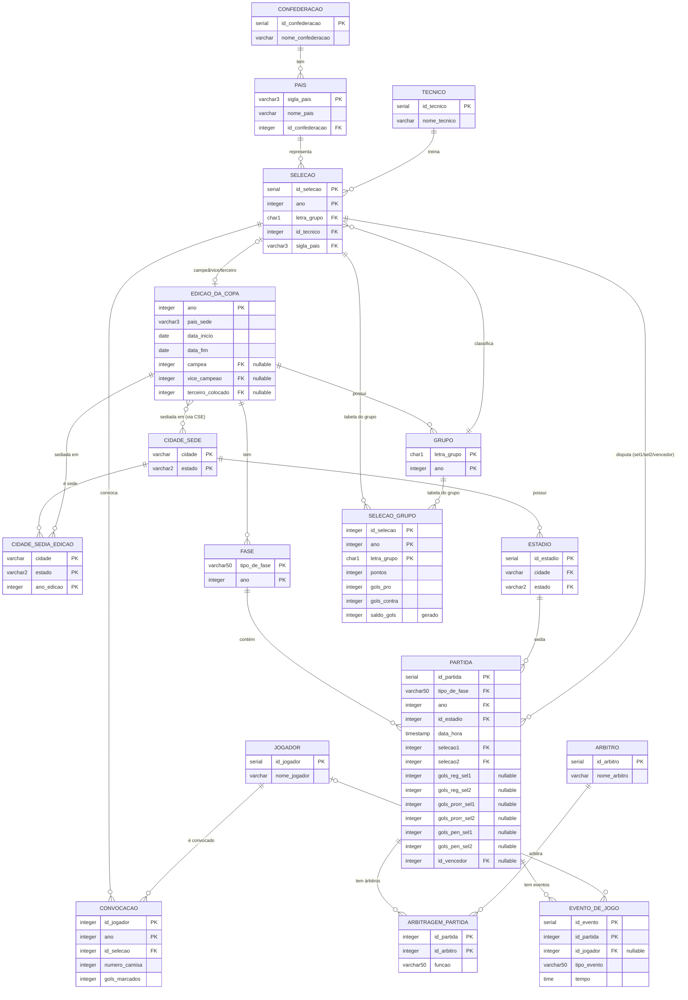

# 🏆 SCC0640 – Sistema de Copas do Mundo FIFA

> **Projeto de Curso** | SCC0640 Bases de Dados  
> USP / ICMC – Prof. Jose Fernando Rodrigues Junior  
> Entrega: 24/05 · Apresentação: 25, 26/05 e 01/06

---

## 👥 Membros do Grupo

<!-- MEMBROS_START -->
| Nome | Nº USP | Responsabilidade na apresentação |
|------|--------|----------------------------------|
| Nome 1 | — | DER + Modelo Relacional |
| André Santos Messias | — | DDL + DML + Triggers |
| Mateus Santos Messias | 12548000 | Implementação do Protótipo |
| Pedro Borges Gudin | 12547997 | Execução + Demonstração |
<!-- MEMBROS_END -->

---

## 🗂️ Estrutura do Repositório

```
bd-copa-do-mundo/
├── diagramas/
│   ├── DER.drawio            ← Diagrama ER (edite aqui no draw.io)
│   ├── MER.drawio            ← Modelo Relacional
│   └── exports/              ← PNGs para o README (atualize manualmente)
├── sql/
│   ├── 05.DDL.sql            ← Criação das tabelas + triggers
│   ├── 06.DML.sql            ← Dados de teste
│   └── consultas.sql         ← As 10 consultas requeridas
├── scripts/
│   └── update_members.py     ← Sincroniza nomes do .txt → README
├── prototipo/                ← Código Python do protótipo
├── .github/workflows/
│   └── export-diagrams.yml   ← CI: atualiza membros no README
└── 08.Instrucoes.txt         ← ⚠️ Preencher nomes/NUSPs antes da entrega
```

> **Como atualizar os PNGs do README:**  
> 1. Abra `DER.drawio` ou `MER.drawio` no [draw.io](https://app.diagrams.net)  
> 2. Edite, salve, exporte como PNG (Border Width: 5, fundo branco)  
> 3. Salve como `diagramas/exports/DER.png` ou `MER.png`  
> 4. Faça commit + push

---

## 📐 Diagramas

### DER — Diagrama Entidade-Relacionamento


_Caso a imagem não carregue, [abra o diagrama no viewer →](https://viewer.diagrams.net/?tags=%7B%7D&target=blank&highlight=0000ff&edit=https%3A%2F%2Fapp.diagrams.net%2F&layers=1&nav=1#Uhttps%3A%2F%2Fraw.githubusercontent.com%2FGUUDIN%2Fbd-copa-do-mundo%2Fmain%2Fdiagramas%2FDER.drawio)_

---

### Modelo Relacional


_Caso a imagem não carregue, [abra no viewer →](https://viewer.diagrams.net/?tags=%7B%7D&target=blank&highlight=0000ff&edit=https%3A%2F%2Fapp.diagrams.net%2F&layers=1&nav=1#Uhttps%3A%2F%2Fraw.githubusercontent.com%2FGUUDIN%2Fbd-copa-do-mundo%2Fmain%2Fdiagramas%2FMER.drawio)_

---

## 🗄️ Esquema do Banco (Mermaid ERD)

> Gerado a partir do DDL — sempre em sincronia com o código.



---

## ⚙️ Triggers implementadas

| # | Trigger | Tabela | Evento | Regra de negócio |
|---|---------|--------|--------|-----------------|
| 1 | `trg_limite_convocacao` | `convocacao` | `BEFORE INSERT` | Máximo 26 jogadores por seleção por edição |
| 2 | `trg_estadio_edicao` | `partida` | `BEFORE INSERT/UPDATE` | Estádio deve pertencer a cidade-sede da edição |
| 3 | `trg_jogador_partida` | `evento_de_jogo` | `BEFORE INSERT/UPDATE` | Jogador deve estar convocado para uma das seleções da partida |
| 4 | `trg_gols_jogador` | `evento_de_jogo` | `AFTER INSERT/UPDATE/DELETE` | Mantém `gols_marcados` em `convocacao` sincronizado |

---

## 📋 Consultas suportadas

| # | Consulta |
|---|----------|
| 1 | Todas as edições com ano, país-sede e campeão |
| 2 | Seleções participantes de uma edição |
| 3 | Grupos de uma edição e suas seleções |
| 4 | Classificação de um grupo |
| 5 | Partidas de uma edição (fase, data, estádio, placar) |
| 6 | Caminho do mata-mata (classificados por fase) |
| 7 | Elenco convocado de uma seleção numa edição |
| 8 | Eventos de uma partida (gols, cartões, substituições) |
| 9 | Artilheiros de uma edição |
| 10 | Histórico de uma seleção (participações, posições, J/V/E/D) |

Ver implementação completa em [`sql/consultas.sql`](sql/consultas.sql).

---

## 🚀 Como executar o protótipo

```bash
# 1. Instalar dependências
pip install psycopg2-binary requests

# 2. Executar
cd prototipo
python main.py

# 3. Na tela de login informe:
#    Host, Porta, Banco, Usuário, Senha do PostgreSQL
#    (o ollama deve estar rodando localmente na porta 11434)
```

Ver instruções completas em [`prototipo/README.md`](prototipo/README.md).

---

## 📦 Arquivos para entrega

| Arquivo entregável | Fonte no repositório | Status |
|--------------------|----------------------|--------|
| `01.ER.pdf`        | exportar `diagramas/DER.drawio` como PDF | ✅ |
| `02.ER.xml`        | renomear `diagramas/DER.drawio` → `02.ER.xml` | ✅ |
| `03.Relacional.pdf`| exportar `diagramas/MER.drawio` como PDF | ✅ |
| `04.Relacional.xml`| renomear `diagramas/MER.drawio` → `04.Relacional.xml` | ✅ |
| `05.DDL.sql`       | `sql/05.DDL.sql` | ✅ |
| `06.DML.sql`       | `sql/06.DML.sql` | 🔄 preencher |
| `07.Prototipo.zip` | zipar pasta `prototipo/` | 🔄 em andamento |
| `08.Instrucoes.txt`| `08.Instrucoes.txt` — preencher NUSPs faltantes | 🔄 preencher |

---

## 🔧 Setup rápido do banco local

```sql
-- No psql:
CREATE DATABASE copa_do_mundo;
\c copa_do_mundo
\i sql/05.DDL.sql
\i sql/06.DML.sql
```
